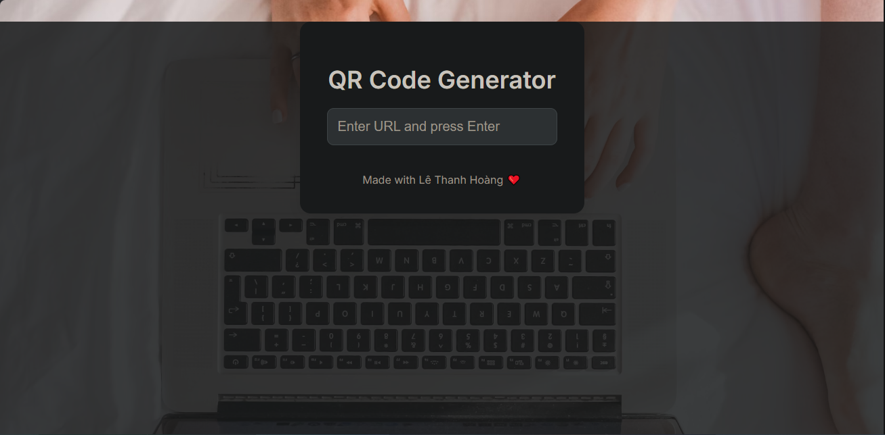

# 📱 QR Code Generator Web

Một ứng dụng web đơn giản giúp bạn tạo mã QR từ văn bản hoặc đường link.

## 🚀 Demo

🔗 [Truy cập web demo tại đây](https://leehoang21.github.io/qrcode-web-demo/)  

## 🛠️ Công nghệ sử dụng

- HTML, CSS, JavaScript
- [QRCode.js](https://davidshimjs.github.io/qrcodejs/) – thư viện tạo QR code client-side

## 📸 Screenshot

  

## 💡 Tính năng

- Nhập văn bản hoặc đường dẫn để tạo mã QR
- Tải mã QR về máy dưới dạng ảnh PNG
- Tự động cập nhật QR code khi thay đổi nội dung

## 📦 Cài đặt cục bộ

```bash
git clone https://github.com/leehoang21/qrcode-web-demo.git
cd qrcode-web-demo
# Mở file index.html trong trình duyệt
